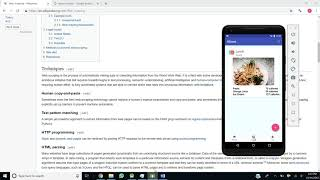

# Consume Healthy
The purpose of my app is to allow people to count their calories to promote healthy lifestyle choices. 

My mobile application is able to automatically determine the amount of calories of any food entered by using web scraping.

## Demo
Here is a link to a demo video of me displaying the differnt features and capabilities of my application.

## Installation

Open and run the project using Android Studio